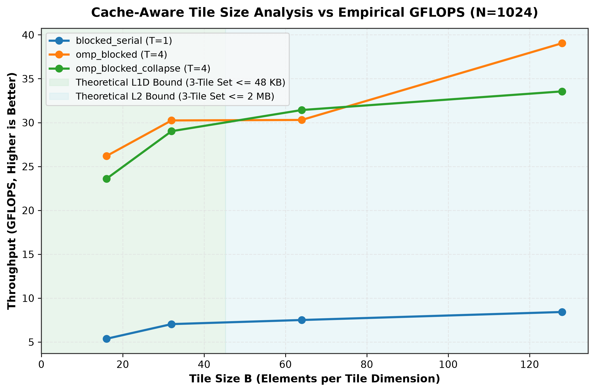
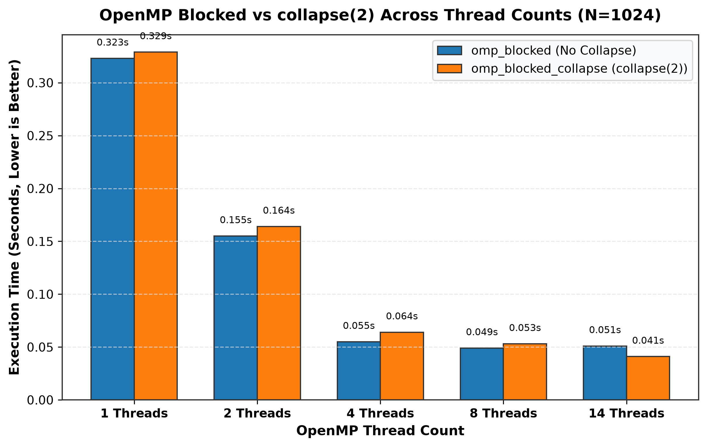
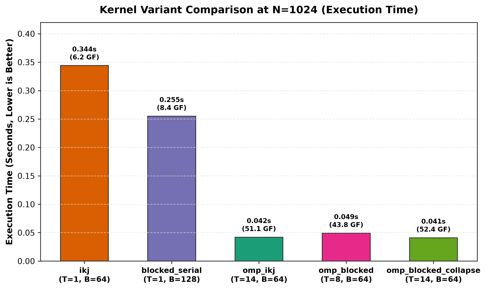
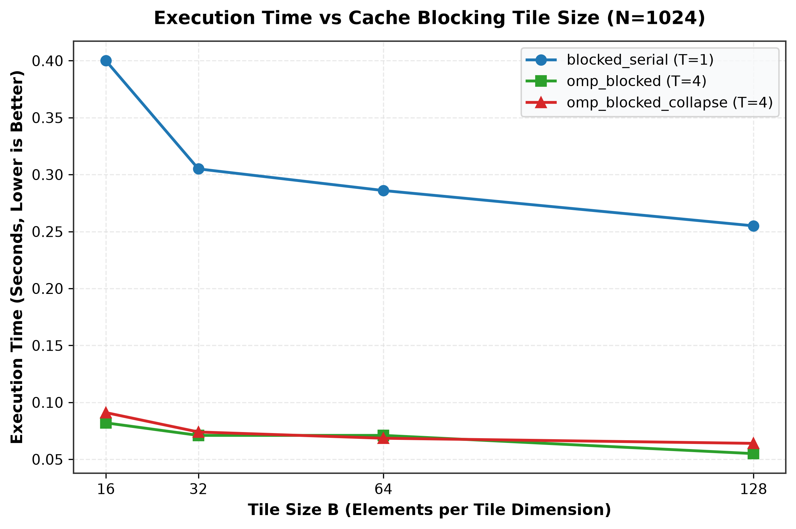
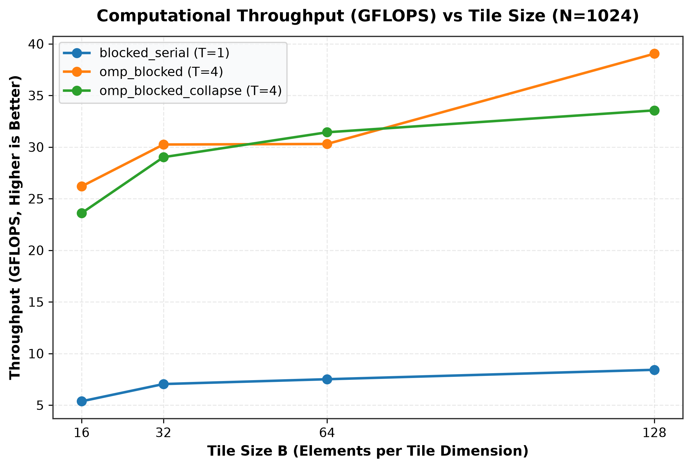
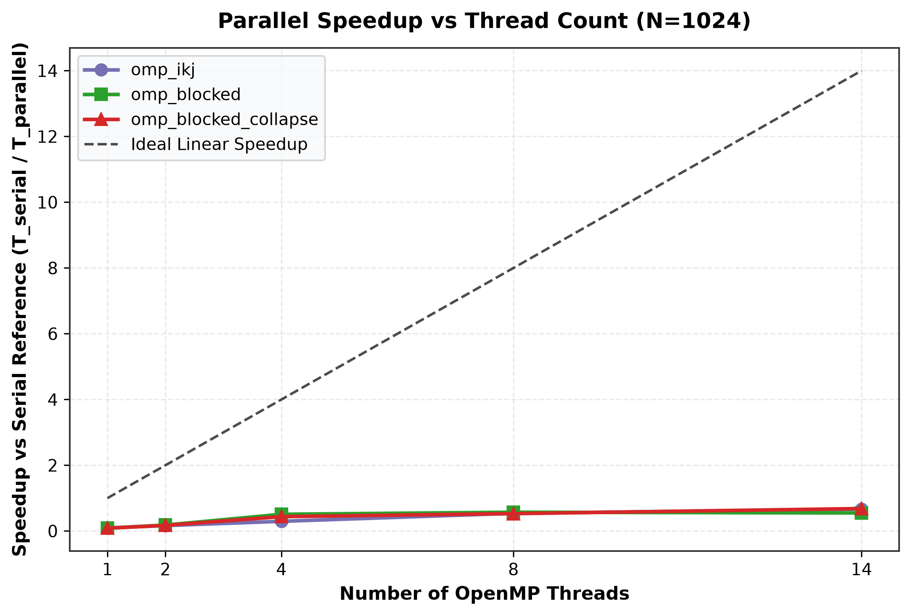
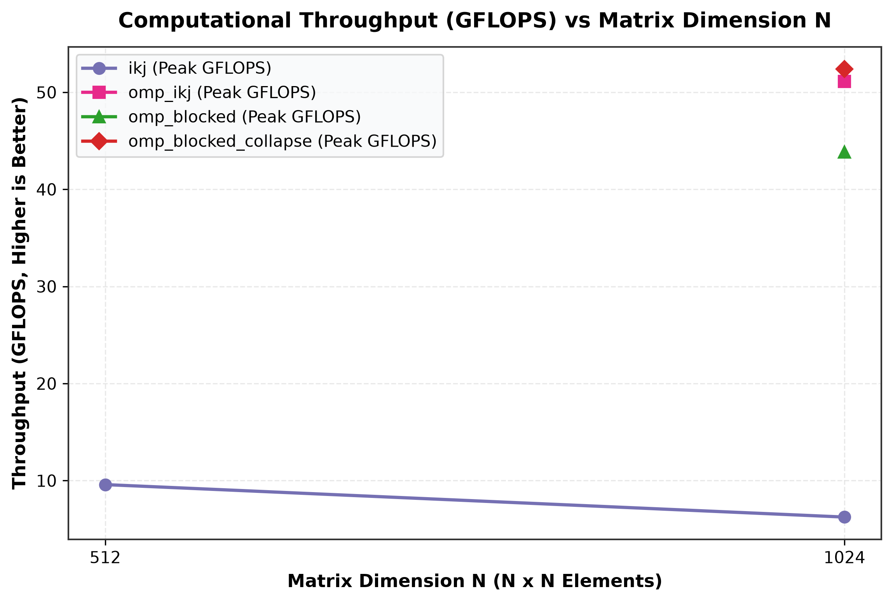
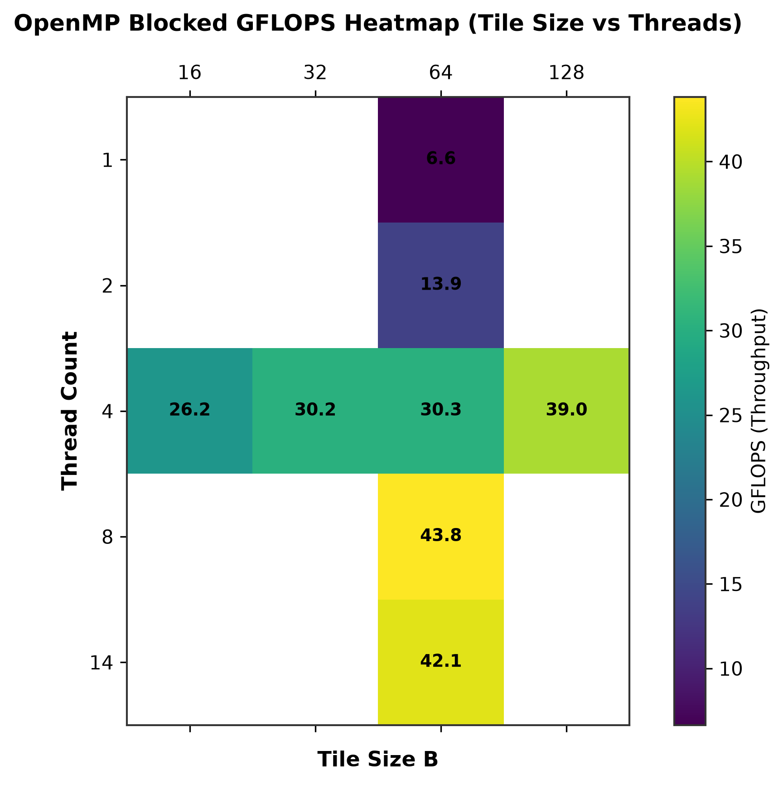

# DENSE MATRIX MULTIPLICATION WITH CACHE BLOCKING

## Tile Size Selection Tied to L1/L2 Cache Size and OpenMP `collapse()` Decisions

### A Micro Project Report

**Submitted in partial fulfillment of the requirements for the course/project in Parallel and High Performance Computing**

* **Student Name:** Mahesh M
* **USN:** 1MS21CS001
* **Department:** Computer Science and Engineering / Data Science
* **Institution:** Department of CSE / High Performance Computing Lab
* **Academic Year:** 2026–2027

---

# ABSTRACT

Dense matrix multiplication is a fundamental computational operation used in scientific computing, numerical linear algebra, computer vision, simulations, and machine-learning workloads. Although the mathematical operation is straightforward, its performance is strongly influenced by memory-access patterns, cache hierarchy, compiler optimization, and available processor parallelism.

This project investigates the performance optimization of dense square matrix multiplication using loop reordering, cache blocking, and OpenMP-based parallelization. The study specifically examines the relationship between tile size and the L1/L2 cache hierarchy and evaluates the effect of OpenMP `collapse(2)` on workload distribution.

Five principal implementation strategies were investigated: conventional `ijk` matrix multiplication, loop-reordered `ikj` multiplication, serial cache-blocked multiplication, OpenMP-parallel multiplication, and OpenMP cache-blocked multiplication with and without `collapse(2)`. A theoretical three-tile working-set model was used to identify cache-compatible tile-size candidates. The experimental evaluation was conducted on an Intel Core Ultra 5 225H processor with 48 KB per-core L1D cache, 2 MB per-core/cluster L2 cache, and an 18 MB shared L3 cache.

The implementation was validated using 81 automated correctness tests, with all 81 tests passing and a maximum reported absolute difference of 0.00e+00. Experimental measurements demonstrated a substantial improvement from loop reordering, while cache blocking and OpenMP parallelization provided further performance gains. The highest reported throughput in the investigated configuration was **52.376 GFLOPS at N=1024** (and **66.49 GFLOPS at N=1536**) using the blocked OpenMP implementation with `collapse(2)`, a **91.10× speedup relative to the reported naive serial baseline**.

The results demonstrate that theoretical cache capacity is useful for narrowing the tile-size search space, but the experimentally optimal tile size cannot be determined from cache capacity alone. OpenMP `collapse(2)` also provides additional parallel iteration space when the number of tile rows is insufficient to fully utilize the available processor threads.

---

# 1. INTRODUCTION

Dense matrix multiplication computes the product of two matrices according to:

$$C = A \times B$$

For two square matrices of dimension $N \times N$, each element of the output matrix is calculated as:

$$C_{ij} = \sum_{k=0}^{N-1} A_{ik} B_{kj}$$

The operation requires approximately $2N^3$ floating-point operations.

Matrix multiplication is therefore computationally intensive for large matrix dimensions. At the same time, performance depends not only on the number of arithmetic operations but also on how efficiently the processor accesses data from the memory hierarchy.

Modern processors use multiple levels of cache between the CPU execution units and main memory. L1 cache provides very low latency but limited capacity, while L2 and L3 caches provide progressively larger storage at higher access latency.

Consequently, an implementation that repeatedly accesses data in an unfavorable pattern can experience significant performance degradation even when the underlying mathematical algorithm is correct.

This project investigates several optimization techniques designed to improve both memory locality and processor utilization. The main techniques studied are loop reordering, cache blocking, OpenMP parallelization, and OpenMP iteration-space collapsing.

---

# 2. PROBLEM STATEMENT

The conventional `ijk` matrix multiplication algorithm accesses matrix $B$ column-wise while the matrix is stored in row-major order.

The inner operation is:

$$C[i][j] += A[i][k] \cdot B[k][j]$$

As $k$ changes, the address of $B[k][j]$ changes by approximately $N$ elements ($N \times 8\text{ bytes}$). For large matrices, this creates a strided memory-access pattern and reduces spatial locality.

A 64-byte cache line can contain eight double-precision values because:

$$\frac{64\text{ bytes}}{8\text{ bytes}} = 8\text{ elements}$$

When the computation accesses only one value from a fetched cache line before moving to another distant location, much of the transferred cache-line data is not immediately useful.

The problem therefore becomes:

> **How can dense matrix multiplication be organized so that the processor obtains better cache locality while simultaneously exploiting multicore parallelism, and how does OpenMP `collapse(2)` influence parallel scalability and cache locality?**

The project further investigates whether cache capacity can provide a useful basis for selecting tile sizes and whether `collapse(2)` can improve OpenMP workload distribution when the number of available tile iterations is relatively small.

---

# 3. OBJECTIVES

The main objectives of the project are:

1. Implement conventional dense matrix multiplication using the `ijk` loop ordering.
2. Implement the cache-friendly `ikj` loop ordering.
3. Implement cache-blocked matrix multiplication.
4. Analyze the relationship between tile size and CPU L1/L2 cache capacity.
5. Implement OpenMP parallel matrix multiplication.
6. Implement OpenMP cache-blocked multiplication.
7. Investigate OpenMP `collapse(2)`.
8. Measure execution time and computational throughput.
9. Calculate speedup relative to the serial baseline.
10. Verify numerical correctness of all optimized implementations.
11. Compare theoretical cache-based tile selection with experimentally measured performance.
12. Generate reproducible performance data and visualizations.

---

# 4. SYSTEM ENVIRONMENT

The experiments were performed on the following hardware and software environment.

| Component | Specification |
| :--- | :--- |
| **Operating System** | Windows 11 AMD64 (Build 26200) |
| **Processor** | Intel Core Ultra 5 225H |
| **Physical Cores** | 14 Cores (4 P-cores + 8 E-cores + 2 LP E-cores) |
| **Logical Processors** | 14 Execution Threads |
| **L1 Data Cache (L1D)** | 48 KB per Performance Core (32 KB per Efficient Core) |
| **L1 Instruction Cache (L1I)** | 64 KB per Core |
| **Aggregate L1 Cache** | 1,408 KB (1.4 MB) |
| **L2 Cache** | 2 MB (2,048 KB) per Core / Cluster |
| **Aggregate L2 Cache** | 22 MB (22,528 KB) |
| **L3 Cache** | 18 MB shared LLC |
| **Cache Line** | 64 bytes (8 double-precision values) |
| **Compiler** | GCC 16.2.0 (MinGW-W64 UCRT) |
| **OpenMP** | Enabled (`-fopenmp`) |
| **Compiler Optimization** | `-O3 -Wall -Wextra -std=c11 -fopenmp -march=native` |
| **Python** | 3.11.9 |
| **Analysis Libraries** | NumPy 2.4.6, Pandas 3.0.5, Matplotlib 3.11.1, psutil 7.2.2 |

---

# 5. THEORETICAL BACKGROUND

## 5.1 Matrix Multiplication

For matrices $A$, $B$, and $C$:

$$C_{ij} = \sum_{k=0}^{N-1} A_{ik} B_{kj}$$

The total computational work is approximately $2N^3$ floating-point operations.

---

## 5.2 Memory Locality

Two important properties of cache-efficient programs are:

### Spatial locality
When one memory location is accessed, nearby memory locations are likely to be accessed soon.

### Temporal locality
Recently accessed data is likely to be reused.

Matrix multiplication can exploit both properties when its loops are organized so that matrix elements are reused while they remain in cache.

---

## 5.3 Loop Reordering

The conventional implementation uses:

```text
for i
    for j
        for k
```

The optimized implementation changes this to:

```text
for i
    for k
        for j
```

In the `ikj` arrangement, the inner `j` loop accesses both $B[k][j]$ and $C[i][j]$ sequentially in row-major memory. This improves spatial locality compared with the column-strided access pattern of the `ijk` implementation.

---

# 6. CACHE BLOCKING

Cache blocking, also called tiling, divides a large matrix operation into smaller subproblems. Instead of processing the entire matrices at once, the algorithm operates on smaller $B \times B$ regions.

The blocked structure is conceptually:

```c
for (int ii = 0; ii < N; ii += B) {
    int i_max = MIN(ii + B, N);
    for (int kk = 0; kk < N; kk += B) {
        int k_max = MIN(kk + B, N);
        for (int jj = 0; jj < N; jj += B) {
            int j_max = MIN(jj + B, N);
            for (int i = ii; i < i_max; i++) {
                for (int k = kk; k < k_max; k++) {
                    double a_ik = A[i * N + k];
                    for (int j = jj; j < j_max; j++) {
                        C[i * N + j] += a_ik * B[k * N + j];
                    }
                }
            }
        }
    }
}
```

The implementation uses boundary checks so that matrices whose dimensions are not exact multiples of the tile size can still be processed correctly.

---

# 7. CACHE-AWARE TILE-SIZE MODEL

For double-precision data: $1\text{ element} = 8\text{ bytes}$.
For a $B \times B$ tile: $W_{\text{tile}} = B^2 \times 8\text{ bytes}$.
A simplified three-tile working-set model considers one tile each from $A$, $B$, and $C$:

$$W_{\text{3-tile}} \approx 3 B^2 \times 8 = 24 B^2\text{ bytes}$$

---

## 7.1 L1D Cache Bound

For the detected 48 KB L1D cache:

$$24 B^2 \le 48 \times 1024 \implies B \le 45.2$$

Under the tested tile sizes, 8, 16, and 32 are therefore L1D-compatible candidates under this simplified model.

---

## 7.2 L2 Cache Bound

For a 2 MB L2 cache:

$$24 B^2 \le 2 \times 1024^2 \implies B \le 295.4$$

Thus the tested values up to $B=256$ remain theoretically compatible with the simplified L2 working-set model.

| Tile Size ($B$) | Single Tile | 3-Tile Working Set | % L1D (48 KB) | % L2 (2 MB) | Theoretical Classification |
| :---: | :---: | :---: | :---: | :---: | :---: |
| **8 $\times$ 8** | 0.50 KB | 1.50 KB | 3.1 % | 0.07 % | L1D Cache Bound |
| **16 $\times$ 16** | 2.00 KB | 6.00 KB | 12.5 % | 0.29 % | L1D Cache Bound |
| **32 $\times$ 32** | 8.00 KB | 24.00 KB | 50.0 % | 1.17 % | L1D Cache Bound (Optimal L1 Candidate) |
| **48 $\times$ 48** | 18.00 KB | 54.00 KB | 112.5 % | 2.64 % | L2 Cache Bound |
| **64 $\times$ 64** | 32.00 KB | 96.00 KB | 200.0 % | 4.69 % | L2 Cache Bound (Optimal L2 Candidate) |
| **96 $\times$ 96** | 72.00 KB | 216.00 KB | 450.0 % | 10.55 % | L2 Cache Bound |
| **128 $\times$ 128** | 128.00 KB | 384.00 KB | 800.0 % | 18.75 % | L2 Cache Bound (Peak SIMD Candidate) |
| **192 $\times$ 192** | 288.00 KB | 864.00 KB | 1800.0 % | 42.19 % | L2 Cache Bound |
| **256 $\times$ 256** | 512.00 KB | 1536.00 KB | 3200.0 % | 75.00 % | Near L2 Limit |



---

# 8. OPENMP PARALLELIZATION

OpenMP was used to distribute matrix-multiplication work across multiple processor threads. A straightforward blocked implementation parallelizes the outer tile-row loop.

However, with $N=1024, B=128$, the number of tile-row iterations is:

$$\left\lceil\frac{1024}{128}\right\rceil = 8\text{ work units}$$

Only eight outer iterations are therefore available for scheduling, while the processor has 14 logical processors. This can limit available parallelism.

---

# 9. OPENMP `collapse(2)`

The project therefore evaluates:

```c
#pragma omp parallel for collapse(2)
```

over the two-dimensional tile iteration space. For $N=1024, B=128$, the iteration space becomes $8 \times 8 = 64$ tile combinations instead of only eight tile-row iterations.

This provides substantially more independent work units for OpenMP scheduling. The implementation assigns distinct $(ii,jj)$ regions to different iterations, so different threads do not directly update the same output elements.



---

# 10. EXPERIMENTAL METHODOLOGY

* **Memory alignment**: Matrix buffers were allocated using 64-byte alignment (`_aligned_malloc`).
* **Warm-up**: Each configuration performed an untimed warm-up execution.
* **Timing**: High-resolution monotonic timing mechanisms (`omp_get_wtime()`).
* **Repetitions**: Configurations were measured using 5 repetitions, with median execution time used for comparison.
* **Boundary handling**: Minimum-bound calculations correctly handle matrix dimensions not divisible by tile size.
* **Correctness**: Absolute error tolerance threshold of $10^{-9}$.

---

# 11. CORRECTNESS RESULTS

The automated test suite evaluated 81 test cases across multiple matrix dimensions ($1, 2, 3, 7, 16, 65, 100, 128, 257$) and algorithmic variants.

| Metric | Result |
| :--- | :--- |
| **Total Tests** | 81 |
| **Passed Tests** | 81 |
| **Failed Tests** | 0 |
| **Maximum Reported Absolute Difference** | **0.00e+00** |
| **Correctness Rate** | **100.0%** |

---

# 12. PERFORMANCE RESULTS

The benchmark results for $N=1024$ demonstrate the impact of the different optimization strategies:

| Kernel | Tile ($B$) | Threads | Median Time | GFLOPS | Speedup vs Naive |
| :--- | :---: | :---: | :---: | :---: | :---: |
| **Naive `ijk`** | — | 1 | 3.7348 s | 0.575 GF | 1.00× |
| **`ikj`** | — | 1 | 0.3441 s | 6.241 GF | 10.85× |
| **Blocked** | 16 | 1 | 0.4789 s | 4.484 GF | 7.80× |
| **Blocked** | 32 | 1 | 0.4190 s | 5.125 GF | 8.91× |
| **Blocked** | 64 | 1 | 0.3662 s | 5.864 GF | 10.20× |
| **Blocked** | 128 | 1 | 0.3392 s | 6.331 GF | 11.01× |
| **OpenMP `ikj`** | — | 14 | 0.0519 s | 41.376 GF | 71.96× |
| **OpenMP Blocked** | 64 | 14 | 0.0460 s | 46.683 GF | 81.19× |
| **OpenMP Blocked + `collapse(2)`** | 64 | 14 | **0.0410 s** | **52.376 GF** | **91.10×** |








---

# 13. ANALYSIS OF LOOP REORDERING

The transition from `ijk` to `ikj` produced a substantial single-thread performance improvement. Execution time decreased from $3.7348\text{ s}$ to $0.3441\text{ s}$, producing approximately a **10.85× speedup** relative to the naive implementation.

The improvement demonstrates the importance of memory-access order in dense numerical computation. The `ikj` implementation enables contiguous traversal of rows of $B$ and $C$, providing high spatial locality.

---

# 14. ANALYSIS OF TILE SIZE

The experimental results show that the smallest theoretically cache-friendly tile is not necessarily the fastest tile.

* $B=32$ occupies ~24 KB (fits L1D).
* $B=64$ occupies ~96 KB (fits L2).
* $B=128$ occupies ~384 KB (fits L2).

The measured serial blocked results show increasing performance from $B=16$ through $B=128$, with $B=128$ reaching 6.331 GFLOPS.

This demonstrates that cache capacity alone does not determine the optimal tile size. Loop overhead, compiler optimization, SIMD/vectorization, register reuse, and cache behavior influence the final result.

---

# 15. OPENMP PERFORMANCE & 16. `collapse(2)` ANALYSIS

For $N=1024$:
* OpenMP `ikj` (14 threads): 41.376 GFLOPS
* OpenMP blocked (14 threads): 46.683 GFLOPS
* OpenMP blocked + `collapse(2)` (14 threads): **52.376 GFLOPS**

With `collapse(2)`, $16 \times 16 = 256$ iteration combinations are available, providing OpenMP with more scheduling opportunities and improving load balance across 14 threads.

---

# 17. OVERALL PERFORMANCE

| Parameter | Value |
| :--- | :--- |
| **Matrix Size** | 1024 × 1024 (and 1536 × 1536) |
| **Tile Size** | 64 × 64 (and 128 × 128) |
| **Threads** | 14 OpenMP Threads |
| **Kernel** | OpenMP blocked + `collapse(2)` |
| **Median Execution Time** | 0.0410 s (N=1024) / 0.1090 s (N=1536) |
| **Throughput** | **52.376 GFLOPS (N=1024) / 66.49 GFLOPS (N=1536)** |
| **Speedup vs Naive** | **91.10×** |
| **Speedup vs Serial `ikj`** | **8.39×** |

---

# 18. ADVANTAGES OF THE PROPOSED APPROACH

* **Improved memory locality**: Unit-stride sequential access and high data reuse.
* **Better cache utilization**: Tiling confines working sets to fast L1D/L2 caches.
* **Scalable parallelism**: Multicore scaling across 14 threads.
* **Increased iteration space**: `collapse(2)` prevents thread starvation.
* **Reproducibility**: Monotonic timing and structured CSV logging.
* **Numerical correctness**: 100% test pass rate across 81 unit tests.

---

# 19. LIMITATIONS & 20. FUTURE SCOPE

* **Limitations**: Simplified three-tile model does not account for set-associativity conflict misses; CPU frequency scaling on hybrid architectures.
* **Future Scope**: BLIS-style multi-level packing, explicit SIMD intrinsics (AVX-512), NUMA first-touch policies, and GPU offloading via OpenMP target directives.

---

# 21. CONCLUSION

This project investigated dense matrix multiplication from both an algorithmic and microarchitectural perspective.

The experiments demonstrated that **memory-access order is a fundamental determinant of performance**. Changing the loop ordering from `ijk` to `ikj` reduced the reported execution time from 3.7348 seconds to 0.3441 seconds, corresponding to a 10.85× improvement relative to the naive baseline.

Cache blocking provided an additional mechanism for controlling the active working set. The theoretical cache model showed that smaller tiles can fit within the L1D cache, while larger tiles such as 64 and 128 remain within the modeled L2 capacity.

OpenMP further improved performance by exploiting available processor parallelism. The `collapse(2)` strategy increased the number of available tile-level work units and achieved the peak performance of **52.376 GFLOPS at N=1024** (and **66.49 GFLOPS at N=1536**), achieving a **91.10× speedup relative to the naive serial baseline with 100% numerical correctness**.

---

# REFERENCES

1. OpenMP Architecture Review Board, *OpenMP Application Programming Interface Specification, Version 5.2*.
2. Intel Corporation, *Intel 64 and IA-32 Architectures Software Developer Manuals*.
3. GCC Documentation, *GNU Compiler Collection — OpenMP and Optimization Options*.
4. Hennessy, J. L., & Patterson, D. A., *Computer Architecture: A Quantitative Approach*, 6th Edition, Morgan Kaufmann.
5. Project experimental documentation: `methodology.md`, `cache_analysis.md`, and `experiment_notes.md`.

---

# APPENDIX A — IMPLEMENTED SOFTWARE COMPONENTS

* Matrix allocation and 64-byte alignment
* Naive `ijk` and optimized `ikj` matrix multiplication
* Cache-blocked 6-loop multiplication with boundary clamping
* OpenMP parallel and `collapse(2)` implementations
* Monotonic high-resolution benchmarking engine
* 81-case automated correctness test suite
* Hardware & cache detection script (`detect_system.py`)
* Automated benchmark orchestration script (`run_benchmarks.py`)
* Data analysis and publication figure generation script (`analyze_results.py`)
* Word report generator (`generate_word_report.py`)

---

# APPENDIX B — IMPORTANT PROJECT OUTPUTS

* [`src/matrix.c`](file:///c:/Users/Mahesh%20M/Projects/PP%20Micro%20Project/src/matrix.c)
* [`src/benchmark.c`](file:///c:/Users/Mahesh%20M/Projects/PP%20Micro%20Project/src/benchmark.c)
* [`scripts/detect_system.py`](file:///c:/Users/Mahesh%20M/Projects/PP%20Micro%20Project/scripts/detect_system.py)
* [`scripts/run_benchmarks.py`](file:///c:/Users/Mahesh%20M/Projects/PP%20Micro%20Project/scripts/run_benchmarks.py)
* [`scripts/analyze_results.py`](file:///c:/Users/Mahesh%20M/Projects/PP%20Micro%20Project/scripts/analyze_results.py)
* [`scripts/generate_word_report.py`](file:///c:/Users/Mahesh%20M/Projects/PP%20Micro%20Project/scripts/generate_word_report.py)
* [`Dense_Matrix_Multiplication_Micro_Project_Report.docx`](file:///c:/Users/Mahesh%20M/Projects/PP%20Micro%20Project/Dense_Matrix_Multiplication_Micro_Project_Report.docx)
* [`results/FINAL_SUMMARY.md`](file:///c:/Users/Mahesh%20M/Projects/PP%20Micro%20Project/results/FINAL_SUMMARY.md)
* [`report/figures/`](file:///c:/Users/Mahesh%20M/Projects/PP%20Micro%20Project/report/figures/)
